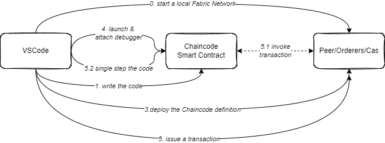
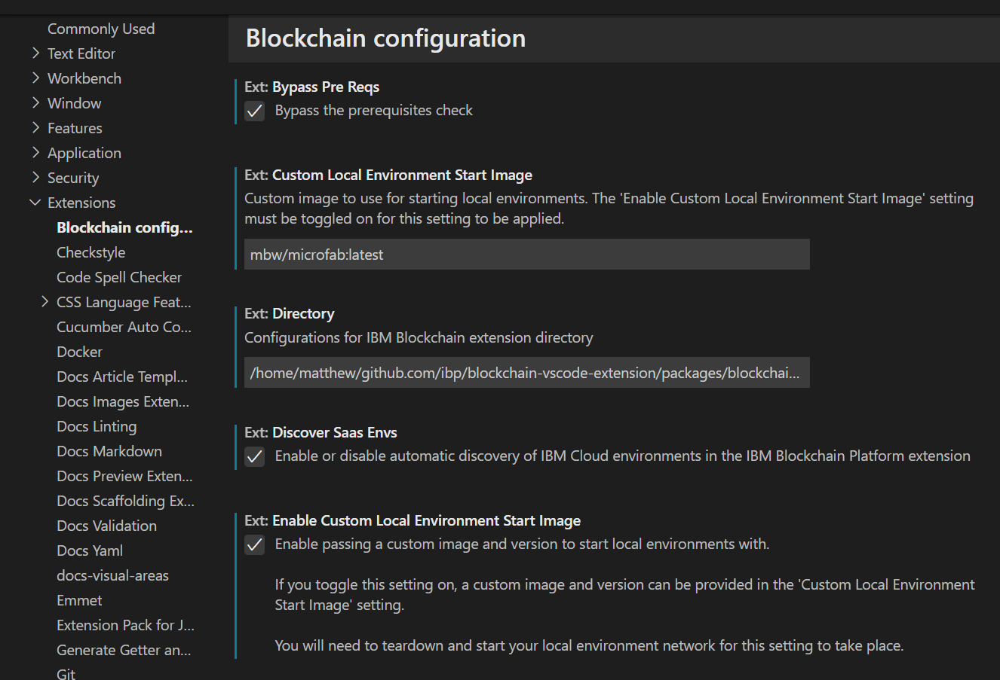
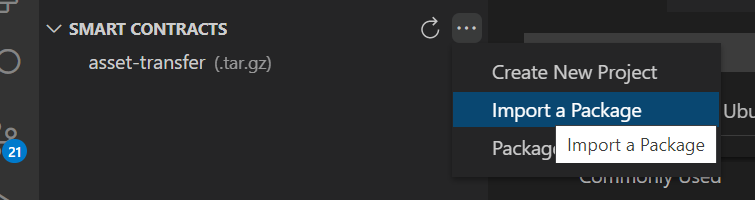
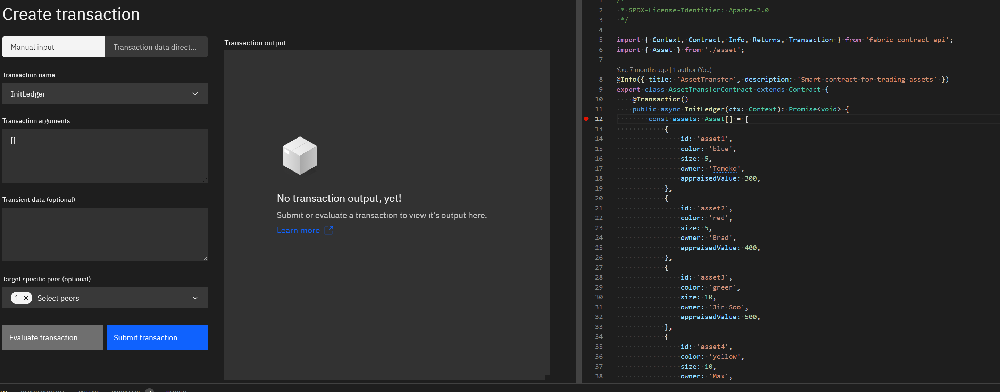

# Develop, Debug and Deploy Smart Contracts - DRAFT

**Aim:** Stand up a Hyperledger Fabric Smart Contract so it can easily debugged
**Objectives:**

- Introduce what Chaincode-as-a-Service is, and how it helps
- Show how to build & configure a Chaincode to run like this
- How to deploy these a running Hyperledger Fabric network
- How then to debug this running Chaincode.

[PREVIOUS - Creating a Blank Contract](./02-Creating-Blank-Contract.md) == [NEXT - Production Deployment](./04-Production-Pipelines.md)
---


## Overview

It helps to think of three 'parts'

- The Fabric network, consisting of the peers, orderers, certificate authorities etc. Along with configured channels and identities.
  For our purposes here, this can be considered as a 'black box'. The 'black box' can be configured a number of different ways, but typically will be one or docker containers.
- The Chaincode - this will be running in it's own docker container.
- The editor - VSCode is covered here, but the approach should hold with other debuggers and editors.



The _high level process_ is

0. Stand up Fabric
1. Develop the Smart Contract
3. Create a chaincode package but using the chaincode-as-a-service approach
   Install/Approve/Commit this package
4. Stand up the Chaincode using the chaincode-as-a-service approach
   Attach your debugger to the running chaincode
5. Invoke a transaction, this will then halt in the debugger to let you step over the code
5. Find the bugs and repeat **from step 4** - note   step 4... you don't need to go back to a new package or approval cycle.

### What do you need?

You'll need to have docker available to you, along with VSCode and the IBM Blockchain Platofrm Extension installed. Also, install the VSCode extensions you prefer for debugging your preferred language.

- For TypeScript and JavaScript VSCode has built-in support
- For Java the [JavaExtension pack](https://marketplace.visualstudio.com/items?itemName=vscjava.vscode-java-pack) is suggested
- For go [_to be added_]

Finally, clone this repo to a directory of your own choice if you want to use the example contract code here. 
### What is Chaincode as Service?

The chaincode-as-a-service feature is a very useful and practical way to run 'Smart Contracts'. Traditionally the Fabric Peer has taken on the role of orchestrating 
the complete lifecycle of the chaincode. It required access to the Docker Daemon to create images, and start containers. Java, Node.js and Go chaincode frameworks were
 explicitly known to the peer including how they should be built and started.

As a result this makes it very hard to deploy into Kubernetes (K8S) style environments, or to run in any form of debug mode. Additionally, the code is being rebuilt by
 the peer therefore there is some degree of uncertainty about what dependencies have been pulled in.

Chaincode-as-service requires you to orchestrate the build and deployment phase yourself. Whilst this is an additional step, it gives control back. The Peer still 
requires a 'chaincode package' to be installed. In this case this doesn't contain code, but the information about where the chaincode is hosted. (Hostname,Port,TLS config etc)

## Which Fabric deployment to use?

The core Peer, Orderer and Certificate Authority binaries can be deployed in many different configurations, for example

- Running Microfab standalone from the extensions
- Fabric's test network found within the fabric-samples repo
- [_test-network-k8s?_]
- [_ibp?_]
- [_minifab?_]

## Creating the Smart Contracts

An important point is that the code written for the Smart Contract is exactly the same, whether it's managed by the peer or Chaincode-as-a-Service. 
What is different is how that is started and packaged. This repo contains a chaincode for each language, these are copied from the Fabric-Samples repo. 
Note that in all cases, the Java/Typescript/Go code is the same, the difference is in the packaging.

### TypeScript/JavaScript

Using the Typescript contract as an example, the difference is easier to see. The package.json contains 4 'start' commands

```
   "start": "fabric-chaincode-node start",
   "start:server-nontls": "fabric-chaincode-node server --chaincode-address=$CHAINCODE_SERVER_ADDRESS --chaincode-id=$CHAINCODE_ID",
   "start:server": "fabric-chaincode-node server --chaincode-address=$CHAINCODE_SERVER_ADDRESS --chaincode-id=$CHAINCODE_ID --chaincode-tls-key-file=/hyperledger/privatekey.pem --chaincode-tls-client-cacert-file=/hyperledger/rootcert.pem --chaincode-tls-cert-file=/hyperledger/cert.pem",
   "start:server-debug": "set -x && NODE_OPTIONS='--inspect=0.0.0.0:9229' fabric-chaincode-node server --chaincode-address=$CHAINCODE_SERVER_ADDRESS --chaincode-id=$CHAINCODE_ID"
```

The first, is used when the peer is completely controlling the chaincode. The second `start:server-nontls` starts in the Chaincode-as-a-service mode (without using TLS). The command
is very similar `fabric-chainmcode-node server` rather than `fabric-chaincode-node start`. Two options are provided here, these are the network address the chaincode
 will listen on and it's id. (aside when the Peer runs the chaincode, it does pass extra options, but they aren't seen in the package.json)

The third `start:server` adds the required TLS configuration, but is otherwise the same.
The forth `start:server-debug` is the same as the non-TLS case, but includes the environment variable required to get Node.js to open a port to allow a debugger to connect remotly.

### Java

The changes for the Java chaincode are logically the same. The build.gradle (or use Maven if you wish) is exactly the same (like there were no changes to the 
TypeScript compilation). With the v2.4.1 Java Chaincode libraries, there are no code changes to make or build changes. The '-as-a-service' mode will be used if
 the environment variable `CHAINCODE_SERVER_ADDRESS` is set.

For the non-TLS case the Java chaincode is started with `java -jar /chaincode.jar` - and will use the Chaincode-as-a-service mode _if_ the  environment variable `CHAINCODE_SERVER_ADDRESS` is set.

For the TLS case .[_to be added_]

For debug, the JVM needs to put into debug mode `java -agentlib:jdwp=transport=dt_socket,server=y,suspend=n,address=0.0.0.0:8000 -jar /chaincode.jar`

### go

[_go to follow_]


## How is the chaincode package different?

A key difference is that the chaincode package, does not contain code. It is used as a holder of data that indicates to the peer where teh chaincode is. What 
host/port and what TLS configuration is needed. Chaincode packages already can hold data about the couchdn indicies to use or the private data collections. 

Within the package the `connection.json` is a key file. At it's simplest it would be 

```json
{
  "address": "assettransfer_ccaas:9999",
  "dial_timeout": "10s",
  "tls_required": false
}
```

This is telling the peer the chaincode is on host `assettransfer_ccaas` port 9999. 10s timeout on connecting, and tls is not needed. 

The packager can be constructed by hand, it's a set of json files, collected together with `tgz`. To help there is [bash script](./contracts/ccaas_pkg.sh) to create the package in this repo.

### Important networking warning

The chaincode package that is installed critically contains the hostname and port that the peer is expecting the chaincode to listening on. If nothing answers the 
peer, it obviously will fail the transaction. 

Note that it is ok not to have the chaincode running at all times, the peer won't complain until it is asked to actually connect to the chaincode. This is an important
 ability as it let's debug, and restart the container.

The hostname that is supplied must be something that the peer, from it's perspective can resolve. Typically the peer will be inside a docker container, therefore
 suppling `localhost` or `127.0.0.1` will resolve to the same container the the peer is running in.

Assuming that the peer is running in a docker container, the chaincode could either be run in it's down docker container, on the same docker network as the peers
 container, or it could be run directly on the host system. 

Depending your host OS, the 'specialhostname' that is used from within the docker container to access the host varies.
 For example see this [stackoverflow post](https://stackoverflow.com/questions/24319662/from-inside-of-a-docker-container-how-do-i-connect-to-the-localhost-of-the-mach#:~:text=To%20access%20host%20machine%20from,using%20it%20to%20anything%20else.&text=Then%20make%20sure%20that%20you,0.0%20.)

The advantage of this is the chaincode can run locally on your hostmachine and is simple to conenct to from a debugger. 

Alternatively, you can package the chaincode into it's own docker container, and run that. You can still debug into this, but need to ensure that the ports of the 
container are exposed correctly for your language runtime.

The first practical will show the approach of using the 'specialhostname', the other examples show how to use a docker container. Neither Fabric, or the Chaincode or
 VSCode really care which approach is used, so long as the network connections can resolve themselves.

## The Practical - with VSCode's built-in Microfab

Firstly using VSCode and MicroFab; the VSCode extension can create a simple Fabric network in Microfab for you. 

> Please do read this section as the later stages are very much the same for all the ways of running fabric.

### Use the latest Microfab version

You need to use the latest microfab version; here I'm using a copy locally rebuilt and tagged with `ibmcom/ibp-microfab-rc`.

In a new VSCode window, open the settings and find the Blockchain Configuration. Enter the name of the "Custom Local Environment Start Image", 
and select the Enable Custom Local Environment Start Image"



### Running and deploying a contract

Add the repo to the workspace, and in a terminal window (either inside or outside VSCode to your preference) change to contract directory, and compile the code.

First we need to `npm install` and `npm build` the chaincode

```bash
cd contracts/asset-transfer-ts
npm install
npm run build
```

This has built the typescript contract. Debug settings have already been included in the typescript configuration. If you get issues with later debugging, check the typescript configuration in `tsconfig.json`

### Create the Chaincode Package

In common with the traditional ways of deploying chaincodes (containing SmartContracts) we need to have a chaincode package. In this case however this package primarily contains the host:port of where the chaincode is running. Currently the peer command can't properly create these, so a batch file has been included that does it.

To create a package

```bash
npm run package:cc

> asset-transfer-basic@1.0.0 package:cc
> ../ccaas_pkg.sh

-rw-r--r-- 1 matthew matthew 461 Jan 27 15:25 asset-transfer.tar.gz
CHAINCODE_ID=asset-transfer_1:5206e43f17e0532a67480d7a384dd402da15f23a713e75db5b5ef898627315a9
```

### Start the local Fabric Network

In the 'Fabric Environments' panel, select the `Add local or remote environment` and choose `Create new from template` and select the first opion - the 1 Org template. Enter a name of your choice, here `nx01`, and you must select the `v2_0` capability.

### Install the chaincode package

In VSCode, click on the Blockchain Icon to get into the Blockchain View. From the Smart Contracts panel, import the `asset-transfer-tar.gz`. In this example this has already been imported



Then from the FabricEnvironment panel, click on the just created environment, and expand the 'channel, so see the `+ Deploy smart contract` option. Select the packaged smart contract, and accept all the default options.

WHen this has deployed, you'll be able to connect to the Channel in the `Fabric Gateways` and expand the channel and see the contract. However if click on the contract, nothing will happen - and in fact in the log there will be an error. The chaincode isn't actually running at this point. 


### Running the chaincode

You can run the chaincode directly from a terminal, you'll need the `CHAINCODE_ID` from earlier.

```
export CHAINCODE_SERVER_ADDRESS=0.0.0.0:9999 
export CHAINCODE_ID=assettransfer_1:b4626214ee5d9a1425f938938905cd91e5b37a6b835553630ace71f0397a1025 
npm run start:server-debug
```

This will start in Chaincode-as-a-Service mode, with the node.js debug options. You can now go back to the `Fabric Gateways` view, and refresh. You'll be able to see all the transaction functions listed now. To get these the VSCode Extension sent a transaction to the chaincode, and it responded with information. 

### Debugging the chaincode

At this point we can issue transactions via the extension to test how things are working. As the chaincode is running separate from the peer's control it's a *lot* easier to attach say a debugger to it. 

In the right window, is the `assetTransfer.ts` file, with a breakpoint added in `InitLedger` (click in the margin to add the breakpoint). By clicking on the InitLedger in the edxpanded Fabric Gateway view, brings up the 'transaction exerciser'.



To connect the debugger, click on the VSCode debugging icon in the toolbar. You'll need to have a configuration for attaching to a remote node process. 
```
    {
        "name": "Attach by Process ID",
        "processId": "${command:PickProcess}",
        "request": "attach",
        "skipFiles": [
            "<node_internals>/**"
        ],
        "type": "pwa-node"
    }
```

Check the VSCode documentation on debugging for more info on how to connect - the chaincode here is, as far as VSCode is concerned, no different from any other node.js application.

Once connected, in the transaction explorer view, `InitLedger` is already selected, and it doesn't need any arguments. Click on `SubmitTransaction`, and you'll find the debugger will stop at the set break point and you can step over the code.

It's advisable not to take too long, as there is a transaction timeout!

When you've identified any problems, and made code changes the approach is to rebuild the code, kill the running node.js process and re run it. 

> You don't need to install, approve or commit again. Just stop, rebuild and restart the chaincode. 

## Practical - with Fabric's Test Network
The `test-network` and some of the chaincodes have been updated to support running chaincode-as-a-service. The commands below assume that you've got the latest fabric-samples cloned, along with the latest Fabric docker images.

It's useful to have two terminal windows open, one for starting the Fabric Network, and a second for monitoring all the docker containers.

In your 'monitoring' window, run this to watch all activity from the all the docker containers on the `fabric_test` network; this will monitor all the docker containers that are added to the `fabric-test` network. The network is usually created by the `./network.sh up` command, so remember to delay running this until at least the network is created. It is possible to precreate the network with `docker network create fabric-test` if you wish.

```bash
# from the fabric-samples repo
./test-network/monitordocker.sh
```

In the 'Fabric Network' window, start the test network

```bash
cd test-network
./network.sh up createChannel
```

You can run other variants of this command, eg to use CouchDB or CAs, without affecting the '-as-a-service' feature. The three keys steps are:

- Build a docker image of the contract. Both `/asset-transfer-basic/chaincode-typescript` and `/asset-transfer-basic/chaincode-java` have been updated with Dockerfiles
- Install, Approve and Commit a chaincode definition. This is unchanged, but the chaincode package contains connection information (hostname,port,tls certificates etc.), not code
- Start the docker container(s) containing the contract

Note that the order listed isn't mandatory. The key thing is that the containers are running before the first transaction is set by the peer. Remember that this could be on the `commit` if the `initRequired` flag is set.

This sequence can be run as follows

```bash
./network.sh deployCCAAS  -ccn basicts -ccp ../asset-transfer-basic/chaincode-typescript
```

This is very similar to the `deployCC` command, it needs the name, and path. But also needs to have the port the chaincode container is going use. As each container is on the `fabric-test` network, you might wish to alter this so there are no collisions with other chaincode containers.

You should be able to see the contract starting in the monitoring window. There will be two containers running, one for org1 and one for org2. The container names contain the organization/peer and the name of the chaincode.

To test things are working you can invoke the 'Contract Metadata' function. For information on how to work as different organizations see [Interacting with the network](https://hyperledger-fabric.readthedocs.io/en/latest/test_network.html#interacting-with-the-network)

```bash
# Environment variables for Org1

export CORE_PEER_TLS_ENABLED=true
export CORE_PEER_LOCALMSPID="Org1MSP"
export CORE_PEER_TLS_ROOTCERT_FILE=${PWD}/organizations/peerOrganizations/org1.example.com/tlsca/tlsca.org1.example.com-cert.pem
export CORE_PEER_MSPCONFIGPATH=${PWD}/organizations/peerOrganizations/org1.example.com/users/Admin@org1.example.com/msp
export CORE_PEER_ADDRESS=localhost:7051
export PATH=${PWD}/../bin:$PATH
export FABRIC_CFG_PATH=${PWD}/../config

# invoke the function
peer chaincode query -C mychannel -n basicts -c '{"Args":["org.hyperledger.fabric:GetMetadata"]}' | jq
```

If you don't have `jq` installed omit `| jq`.  The metadata shows the details of the deployed contract and is JSON, so jq makes it easier to read.  You can repeat the above commands for org2 to confirm that is working.

To run the Java example, change the `deployCCAAS` command as follows, This will create two new containers.

```bash
./network.sh deployCCAAS  -ccn basicj -ccp ../asset-transfer-basic/chaincode-java
```

### Troubleshooting

If the JSON structure passed in is badly formatted JSON this error will be in the peer log:

```
::Error: Failed to unmarshal json: cannot unmarshal string into Go value of type map[string]interface {} command=build
```

## How to configure each language

Each language can work in the '-as-a-service' mode. Note that the approaches here are based on the very latest libraries.
When starting the image you can also specify any of the TLS options or additional logging options for the respective chaincode libraries.

### Java

With the v2.4.1 Java Chaincode libraries, there are no code changes to make or build changes. The '-as-a-service' mode will be used if the environment variable `CHAINCODE_SERVER_ADDRESS` is set.

A sample docker run command could be as follows. The two key variables that are needed are the `CHAINCODE_SERVER_ADDRESS` and `CORE_CHAICODE_ID_NAME`

```bash
    docker run --rm -d --name peer0org1_assettx_ccaas  \
                  --network fabric_test \
                  -e CHAINCODE_SERVER_ADDRESS=0.0.0.0:9999 \
                  -e CORE_CHAINCODE_ID_NAME=<use package id here> \
                   assettx_ccaas_image:latest
```

### Node.js

For Node.js (JavaScript or TypeScript) chaincode, typically the `package.json` has `fabric-chaincode-node start` as the main start command. To run in the '-as-a-service' mode change this to `fabric-chaincode-node server --chaincode-address=$CHAINCODE_SERVER_ADDRESS --chaincode-id=$CHAINCODE_ID`

## Debugging the Chaincode

Running in the '-as-a-service' mode offers options, similar to how the Fabric 'dev' mode works on debugging code. The restrictions of the 'dev' mode don't apply.

There is an option `-ccaasdocker false` that can be provided on the `deployCCAAS` command. This will _not_ build the docker image or start a docker container. It does output the commands it would have run.

Run this command, and you'll see similar output

```bash
./network.sh deployCCAAS  -ccn basicj -ccp ../asset-transfer-basic/chaincode-java -ccaasdocker false
#....
Not building docker image; this the command we would have run
docker build -f ../asset-transfer-basic/chaincode-java/Dockerfile -t basicj_ccaas_image:latest --build-arg CC_SERVER_PORT=9999 ../asset-transfer-basic/chaincode-java
#....
Not starting docker containers; these are the commands we would have run
    docker run --rm -d --name peer0org1_basicj_ccaas                    --network fabric_test                   -e CHAINCODE_SERVER_ADDRESS=0.0.0.0:9999                   -e CHAINCODE_ID=basicj_1.0:59dcd73a14e2db8eab7f7683343ce27ac242b93b4e8075605a460d63a0438405 -e CORE_CHAINCODE_ID_NAME=basicj_1.0:59dcd73a14e2db8eab7f7683343ce27ac242b93b4e8075605a460d63a0438405                     basicj_ccaas_image:latest
```

Depending on your directory, and what you need to debug you might need to adjust these commands.

### Building the docker image

The first thing needed is to build the docker image. Remember that so long as the peer can connect to the hostname:port given in the `connection.json` the actual packaging of the chaincode is not important to the peer. You are at liberty to adjust the dockerfiles given hgere.

To manually build the docker image for the `asset-transfer-basic/chaincode-java`

```bash
docker build -f ../asset-transfer-basic/chaincode-java/Dockerfile -t basicj_ccaas_image:latest --build-arg CC_SERVER_PORT=9999 ../asset-transfer-basic/chaincode-java
```

### Starting the docker container

You need to start the docker container.

NodeJs for example, could be started like this

```bash
 docker run --rm -it -p 9229:9229 --name peer0org2_basic_ccaas --network fabric_test -e DEBUG=true -e CHAINCODE_SERVER_ADDRESS=0.0.0.0:9999 -e CHAINCODE_ID=basic_1.0:7c7dff5cdc43c77ccea028c422b3348c3c1fb5a26ace0077cf3cc627bd355ef0 -e CORE_CHAINCODE_ID_NAME=basic_1.0:7c7dff5cdc43c77ccea028c422b3348c3c1fb5a26ace0077cf3cc627bd355ef0 basic_ccaas_image:latest
```

Java for example, could be started like this

```bash
 docker run --rm -it --name peer0org1_basicj_ccaas -p 8000:8000 --network fabric_test -e DEBUG=true -e CHAINCODE_SERVER_ADDRESS=0.0.0.0:9999 -e CHAINCODE_ID=basicj_1.0:b014a03d8eb1898535e25b4dfeeb3f8244c9f07d91a06aec03e2d19174c45e4f -e CORE_CHAINCODE_ID_NAME=basicj_1.0:b014a03d8e
b1898535e25b4dfeeb3f8244c9f07d91a06aec03e2d19174c45e4f  basicj_ccaas_image:latest
```

For all languages please note:

- the name of the container needs to match what the peer has in the `connection.json`
- the peer is connecting to the chaincode container via the docker network. Therefore port 9999 does not need to be forwarded to the host
- If you are going to single step in a debugger, then you are likely to hit the Fabric transaction timeout value. By default this is 30 seconds, meaning the chaincode has to complete transactions in 30 seconds or less. In the `test-network/docker/docker-composer-test-net.yml` add `CORE_CHAINCODE_EXECUTETIMEOUT=300s` to the environment options of each peer.
- In the command above, the `-d` option has been removed from the command the test-network would have used, and has been replaced with `-it`. This means that docker container will not run in detached mode, and will run in the foreground.

For Node.js please note:

- Port 9229 is forwarded however - this is the debug port used by Node.js
- `-e DEBUG=true` will trigger the node runtime to be started in debug mode. This is encoded in the `docker/docker-entrypoint.sh` script - this is an example and you may wish to remove this in production images for security
- If you are using typescript, ensure that the typescript has been compiled with sourcemaps, otherwise a debugger will struggle matching up the source code.

For Java please note:

- Port 800 is forwarded, the debug port for the JVM
- `-e DEBUG=true` will trigger the node runtime to be started in debug mode. This is encoded in the `docker/docker-entrypoint.sh` script - this is an example and you may wish to remove this in production images for security
- In the java command with the option to start the debugger is `java -agentlib:jdwp=transport=dt_socket,server=y,suspend=n,address=0.0.0.0:8000 -jar /chaincode.jar`   Note the `0.0.0.0` as the debug port needs to be bound to all network adapters so the debugger can be attached from outside the container

## Running with multiple peers

In the traditional approach, each peer that the chaincode is approved on will have a container running the chaincode. With the '-as-a-service' approach we need to achieve the same architecture.

As the `connection.json` contains the address of the running chaincode container, it can be updated to ensure that each peer connects to a different container. However the as the `connection.json` in the chaincode package, Fabric mandates that the package id is consistent amongst all peers in an organization. To achieve that
the the external builder supports a template capability. The context from this template is taken from an environment variable set on each Peer. `CHAINCODE_AS_A_SERVICE_BUILDER_CONFIG`

We can define the address to be a template in the `connection.json`

```json
{
  "address": "{{.peername}}_assettransfer_ccaas:9999",
  "dial_timeout": "10s",
  "tls_required": false
}
```

In the peer's environment configuration we then set for org1's peer1

```bash
CHAINCODE_AS_A_SERVICE_BUILDER_CONFIG="{\"peername\":\"org1peer1\"}"
```

The external builder will then resolve this address to be `org1peer1_assettransfer_ccaas:9999` for the peer to use.

Each peer can have their own separate configuration, and therefore different addresses. The JSON string that is set can have any structure, so long as the templates (in golang template syntax) match.

Any value in the `connection.json` can be templated - but only the values and not the keys.****
## Practical - with standalone Microfab


In this demo scenario, we'll be running two docker containers. As these need to interact we need to create a dedicated docker network

```bash
docker network create audit_network
```

Startup the Fabric Infrastructure, we're using MicroFab here as it's a single container and fast to start. Plus it already has the configuration required within it to start external chaincodes.

```bash
export MICROFAB_CONFIG='{
    "endorsing_organizations":[
        {
            "name": "Ampretia"
        }
    ],
    "channels":[
        {
            "name": "auditnet",
            "endorsing_organizations":[
                "Ampretia"
            ]
        }
    ],
    "capability_level":"V2_0"
}'

docker run --name microfab --network audit_network --rm -ti -p 8080:8080 -e MICROFAB_CONFIG="${MICROFAB_CONFIG}"  ibmcom/ibp-microfab

```

