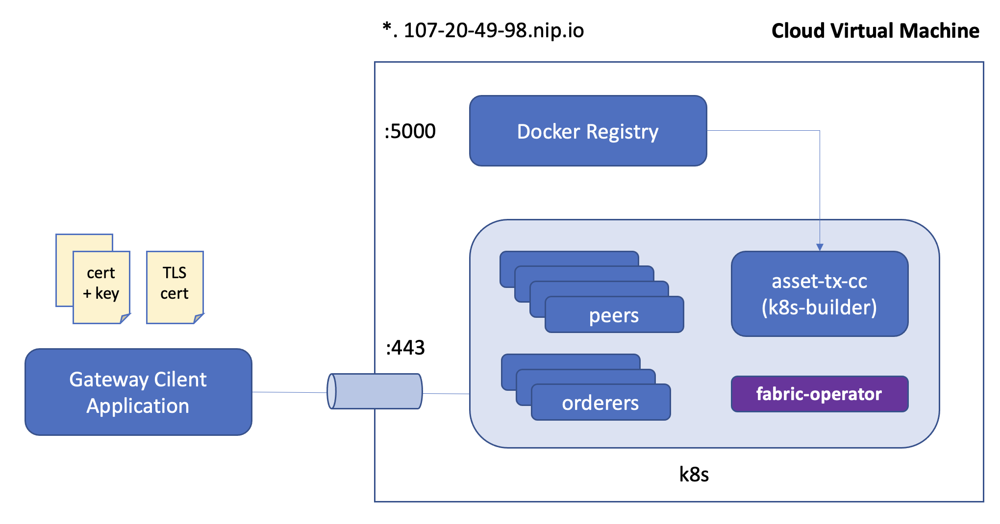

# Full stack with EC2 VM instance and Fabric Operator 

This scenario sets up a KIND Kubenetes cluster on an EC2 VM, using [fabric-operator](https://github.com/hyperledger-labs/fabric-operator)
to create a Fabric network by applying a series of peer, orderer, and CA CRDs to the k8s API controller.

Chaincode may be run on the host OS "as a service", or the image can be uploaded to a container registry and launched
in the cluster using the [k8s chaincode builder](https://github.com/hyperledger-labs/fabric-builder-k8s).

Gateway applications run locally on the HOST OS, connecting to the Fabric network endpoints via Nginx ingress.



## Prerequisites

- Fabric CLI binaries:
```shell
curl -sSL https://raw.githubusercontent.com/hyperledger/fabric/main/scripts/bootstrap.sh | bash -s -- -s -d
export PATH=$PWD/bin:$PATH

```

- [jq](https://stedolan.github.io/jq/download/)


## Create an EC2 Virtual Machine

- Use `t2.xlarge` profile (4 CPU / 8 GRAM)
- copy/paste `infrastructure/ec2-cloud-config.yaml` as the instance user-data 
- Create / reference an ssh key pair for remote login.  Save locally as `~/Downloads/ec2-key.pem`
- After the instance is up, identify the PUBLIC IPV4 address.  This will be used extensively for all access to the cluster: 

```shell
export EC2_INSTANCE_IP=107.20.49.98
export EC2_INSTANCE_KEY=~/Downloads/ec2-key.pem
```

## Operator Sample Network

- open a shell to the instance: 
```shell
ssh -i $EC2_INSTANCE_KEY ubuntu@${EC2_INSTANCE_IP}
```

```shell
git clone https://github.com/hyperledger-labs/fabric-operator.git

```

- Install the sample network on a KIND kubernetes cluster: 
```shell
cd ~/fabric-operator/sample-network 

export TEST_NETWORK_INGRESS_DOMAIN=$(curl -s http://checkip.amazonaws.com | cut -d ' ' -f 1 | tr -s '.' '-').nip.io 
export TEST_NETWORK_LOCAL_REGISTRY_INTERFACE=0.0.0.0
export TEST_NETWORK_PEER_IMAGE=ghcr.io/hyperledger-labs/k8s-fabric-peer
export TEST_NETWORK_PEER_IMAGE_LABEL=v0.7.2
export TEST_NETWORK_STAGE_DOCKER_IMAGES=false

time ./network kind 
time ./network cluster init
time ./network up
time ./network channel create 

```

- Observe the target Kubernetes namespace
```shell
k9s -n test-network

```


### Install the Chaincode

After the network has been set up in the VM, all interaction will occur via the Ingress on port :443.

To avoid the use of a public container registry, the VM has been configured with an insecure Docker
registry at port :5000.  Before images can be uploaded to the cluster, the Docker engine must be configured with
the insecure registry URL and restarted.

E.g. on OSX / Docker Desktop, add the following stanza to the Docker -> Preferences -> Docker Engine config, using
the `$TEST_NETWORK_DOMAIN` as allocated to the multipass VM:
```json
{  
  "insecure-registries": [
    "107-20-49-98.nip.io:5000"
  ]
}
```

Open a new shell on the host OS:
```shell
# This will be different for each instance.  Use the public IPv4 assigned by AWS: 
export EC2_INSTANCE_IP=107.20.49.98
export EC2_INSTANCE_KEY=~/Downloads/ec2-key.pem
export TEST_NETWORK_DOMAIN=$(echo $EC2_INSTANCE_IP | tr -s '.' '-').nip.io

echo "Fabric domain: $TEST_NETWORK_DOMAIN"

```

- Extract the crypto material from the instance, copying to a local folder: 
```shell
ssh -i $EC2_INSTANCE_KEY ubuntu@$TEST_NETWORK_DOMAIN \
  tar cf - -C fabric-operator/sample-network temp \
  | tar xvf - -C config 

```

- Set the peer context for the Org1 administrator:
```shell
export FABRIC_CFG_PATH=$PWD/config
export CORE_PEER_LOCALMSPID=Org1MSP
export CORE_PEER_ADDRESS=${TEST_NETWORK_NS}-org1-peer1-peer.${TEST_NETWORK_DOMAIN}:443
export CORE_PEER_TLS_ENABLED=true
export CORE_PEER_MSPCONFIGPATH=$PWD/config/temp/enrollments/org1/users/org1admin/msp
export CORE_PEER_TLS_ROOTCERT_FILE=$PWD/config/temp/channel-msp/peerOrganizations/org1/msp/tlscacerts/tlsca-signcert.pem
export CORE_PEER_CLIENT_CONNTIMEOUT=10s
export CORE_PEER_DELIVERYTIMEOUT_CONNTIMEOUT=10s

export ORDERER_ENDPOINT=${TEST_NETWORK_NS}-org0-orderersnode1-orderer.${TEST_NETWORK_DOMAIN}:443
export ORDERER_TLS_CERT=${PWD}/config/temp/channel-msp/ordererOrganizations/org0/orderers/org0-orderersnode1/tls/signcerts/tls-cert.pem
export CHANNEL_NAME=mychannel
```

- Build a docker image, upload to the docker registry, and prepare a k8s chaincode package:
```shell
export CHAINCODE_NAME=asset-tx-typescript
export CONTAINER_REGISTRY=$TEST_NETWORK_DOMAIN:5000
export CHAINCODE_IMAGE=$CONTAINER_REGISTRY/$CHAINCODE_NAME

docker build -t $CHAINCODE_IMAGE contracts/$CHAINCODE_NAME
docker push $CHAINCODE_IMAGE

IMAGE_DIGEST=$(docker inspect --format='{{index .RepoDigests 0}}' $CHAINCODE_IMAGE | cut -d'@' -f2)

infrastructure/pkgcc.sh -l $CHAINCODE_NAME -n localhost:5000/$CHAINCODE_NAME -d $IMAGE_DIGEST
 
```

- Install the contract to org1-peer1:
```shell
export VERSION=1
export SEQUENCE=1

```

```shell
peer lifecycle chaincode install ${CHAINCODE_NAME}.tgz 

export PACKAGE_ID=$(peer lifecycle chaincode calculatepackageid ${CHAINCODE_NAME}.tgz) && echo $PACKAGE_ID

peer lifecycle \
	chaincode       approveformyorg \
	--channelID     ${CHANNEL_NAME} \
	--name          ${CHAINCODE_NAME} \
	--version       ${VERSION} \
	--package-id    ${PACKAGE_ID} \
	--sequence      ${SEQUENCE} \
	--orderer       ${ORDERER_ENDPOINT} \
	--tls --cafile  ${ORDERER_TLS_CERT} \
	--connTimeout   15s

peer lifecycle \
	chaincode       commit \
	--channelID     ${CHANNEL_NAME} \
	--name          ${CHAINCODE_NAME} \
	--version       ${VERSION} \
	--sequence      ${SEQUENCE} \
	--orderer       ${ORDERER_ENDPOINT} \
	--tls --cafile  ${ORDERER_TLS_CERT} \
	--connTimeout   15s

```

```shell
peer chaincode query -n $CHAINCODE_NAME -C mychannel -c '{"Args":["org.hyperledger.fabric:GetMetadata"]}' | jq

```

## Gateway Application Development

### Register and enroll a new user at the org1 CA

```shell
USERNAME=org1user 
PASSWORD=org1userpw
```

```shell
fabric-ca-client  register \
  --id.name       ${USERNAME} \
  --id.secret     ${PASSWORD} \
  --id.type       client \
  --url           https://${TEST_NETWORK_NS}-org1-ca-ca.${TEST_NETWORK_DOMAIN} \
  --tls.certfiles $PWD/config/temp/cas/org1-ca/tls-cert.pem \
  --mspdir        $PWD/config/temp/enrollments/org1/users/rcaadmin/msp

fabric-ca-client enroll \
  --url           https://${USERNAME}:${PASSWORD}@${TEST_NETWORK_NS}-org1-ca-ca.${TEST_NETWORK_DOMAIN} \
  --tls.certfiles $PWD/config/temp/cas/org1-ca/tls-cert.pem \
  --mspdir        $PWD/config/temp/enrollments/org1/users/${USERNAME}/msp
  
```

```shell
export PEER_HOST_ALIAS=${TEST_NETWORK_NS}-org1-peer1-peer.${TEST_NETWORK_DOMAIN} 
export PEER_ENDPOINT=${TEST_NETWORK_NS}-org1-peer1-peer.${TEST_NETWORK_DOMAIN}:443

export KEY_DIRECTORY_PATH=$PWD/config/temp/enrollments/org1/users/${USERNAME}/msp/keystore/
export CERT_PATH=$PWD/config/temp/enrollments/org1/users/${USERNAME}/msp/signcerts/cert.pem
export TLS_CERT_PATH=$PWD/config/temp/channel-msp/peerOrganizations/org1/msp/tlscacerts/tlsca-signcert.pem

```

### Go Bananas

```shell
pushd applications/trader-typescript 
npm install
```

```shell
npm start create banana bananaman yellow 

npm start getAllAssets

npm start transfer banana appleman Org1MSP 

npm start getAllAssets 

npm start transfer banana bananaman Org2MSP 

npm start transfer banana bananaman Org1MSP 

```

## Teardown

- Delete crypto material: 
```shell
popd 
rm -rf config/build 

```

- Terminate EC2 Instance 